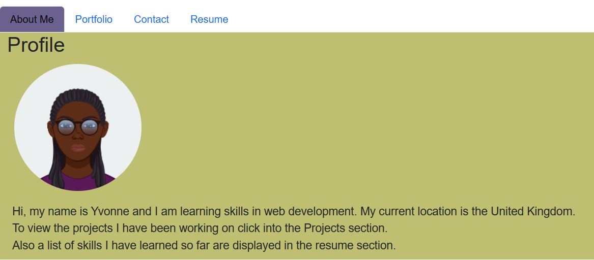

# React Portfolio

## Table of Contents

- [Project Description](#Description)
- [Installation](#Installation)
- [Usage](#Usage)
- [License](#License)
- [Contributors](#Contributors)
- [Questions](#Questions)

## Description

Create a React application that displays a portfolio of projects to showcase skills developed.

## Installation

To install the required dependencies, run the following commands:

npm install, npx create-react-app, npm install gh-pages,
npm install bootstrap

To start the application use the command:

npm start

## Usage

Following is an image of the application and the deployed link:

https://salmy001.github.io/projects/

## License

This project is under the GPL license:

Please refer to license in the repo.

## Contributors

Sources viewed to help in the development of the app include:

https://react.dev/

https://www.npmjs.com/package/gh-pages

https://getbootstrap.com/docs/4.0/getting-started/webpack/

## Questions

If you have any questions about the repo, you can contact me on email: salmy75987@gmail.com

You can also open an issue to contact me or find more of my work at: SalmY001 (https://github.com/SalmY001)
